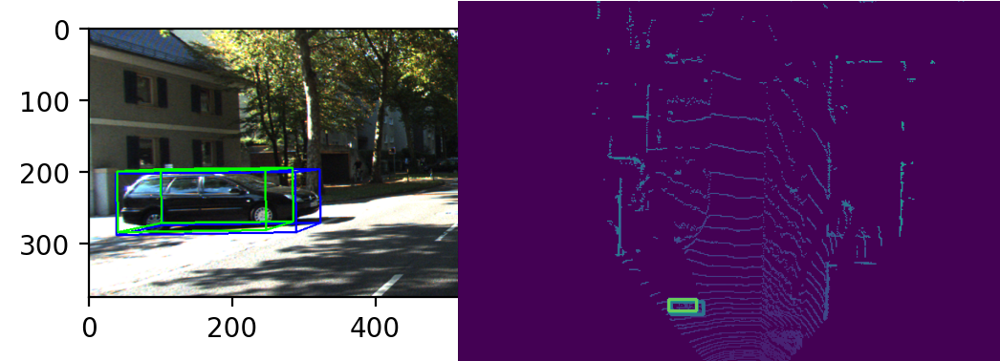

# PointPainting
An implementation of PointPainting (https://arxiv.org/abs/1911.10150), an image-lidar fusion algorithm for 3D object detection. Code is partly based on the [Pointpillars](https://github.com/nutonomy/second.pytorch) repo as well as [this](https://github.com/sgrvinod/a-PyTorch-Tutorial-to-Object-Detection) object detection repo. The algorithm involves performing a semantic segmentation of the image, projecting the pointcloud to the resulting segmentation map to give each lidar point its class score, and running the augmented pointcloud through a 2D object detector (SSD) in BEV.


Above shows predicted (green) bounding boxes for an image and BEV map as well as ground truths (blue)


Clone the repo:
```
git clone https://github.com/rshilliday/painting.git
cd painting
pip install requirements.txt
```
Download and unzip the [KITTI Dataset](http://www.cvlibs.net/datasets/kitti/eval_object.php?obj_benchmark=bev) (images, lidar, labels, calib)
Also download and save [weights](https://drive.google.com/file/d/1nqSDmTx97Y23j7L3Wca5hPudxXp57A7J/view?usp=sharing) for the semantic segmentation network

Train and evaluate the network:
```
python train.py
python eval.py
```

## Future Work:
- [ ] Add data augmentation
- [ ] Add Focal Loss
- [ ] Add rotation prediction
